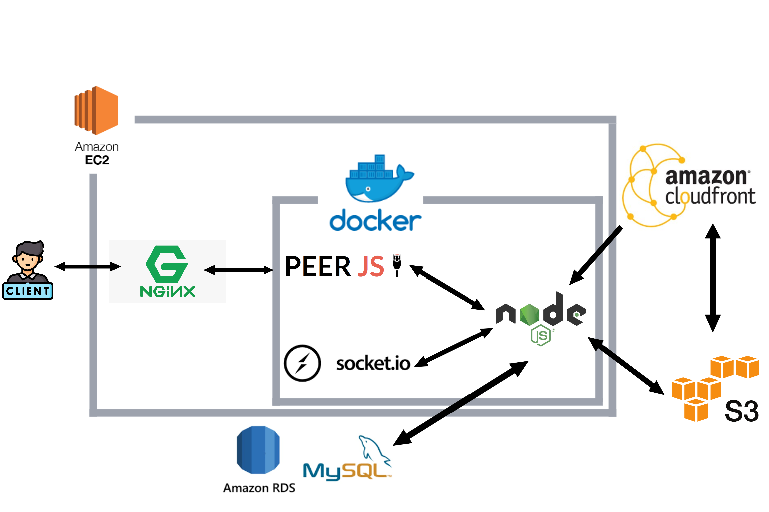

# [maomaoplanet-website](https://maomaoplanet.website/)

 

maomaoplanet is a communication website where you can make calls and chat with family and friends.

 

🔗Website URL: https://maomaoplanet.website/

 
test account
 
 

| Account  	| test@test.com | spongebob@gmail.com| patrickstar@gmail.com|
|-----------|---------------|--------------------|----------------------
|  Password |test           | spongebob          | patrickstar|

## Catalog
* [Main Features](#main-features) 
* [Tech Stack](#tech-stack)
* [Backend Architecture](#backend-architecture)
* [Contact](#contact)

 

* One-to-one chat feature

 
 
 
 

* One-to-one calling feature

 
 
 
 

* Group chat feature

 
 
 
 

* Group calling feature

 
 
 
 

## Main Features

* Account registration requires email verification.
* Writing unit test for some APIs
* User authentication with Json Web Token.
* MySQL(AWS RDS): Using connection pool to reduce connection cost and using Databases of Normalization.
* AJAX: fetch RESTful APIs from backend.
* Socket.io technology is used to create real-time communication functionality.
* webRTC is used to enable group and one-on-one calling functionality.
* Using AWS CloudFront to speed up distribution of static files by CloudFront.
* Using AWS S3 to storing files such as photos and videos uploaded by users.
* Using MVC architecture.
* Using	Docker to build image and deploy web server on AWS EC2.
* Nginx: establish as Reverse Proxy.
* Creating API document by Swagger.
* Swagger link: https://maomaoplanet.website/api-docs/

## Tech Stack

## Backend
* Node.js(Express)
* Socket.IO
* WebRTC(PeerJS)
* Docker
* MVC
* AWS EC2, S3, RDS(MySql), CloudFront
* JSON Web Token(JWT)
* RESTful APIs
* Nginx

## Test

* Unit test: Jest, Sinon, Supertest

## Frontend
* JavaScript
* HTML
* CSS
* AJAX

## Backend Architecture

## Contact
👨🏻‍💻 Name: 李昱醇 LEE YU CHUN

📬 Email: rita09436@gmail.com

