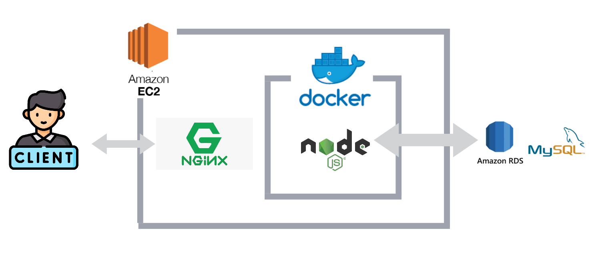

# [maomaoplanet-website](https://maomaoplanet.website/)

 

maomaoplanet is a communication website where you can make calls and chat with family and friends.

 

🔗Website URL: https://maomaoplanet.website/

 
test account
 
 

| Account  	| test@test.com |
|-----------|---------------|
|  Password |test           |

## Catalog

  * [Features](README.md#Main Features) 

  * [contact](README.md#Contact)

 

* One-to-one chat feature

 
 
 
 

* One-to-one calling feature

 
 
 
 

* Group chat feature

 
 
 
 

* Group calling feature

 
 
 
 

#Main Features

* Account registration requires email verification.
* User authentication with Json Web Token.
* Socket.io technology is used to create real-time communication functionality.
* webRTC is used to enable group and one-on-one calling functionality.
* Using AWS CloudFront to speed up distribution of static files by CloudFront.
* Using AWS S3 to storing files such as photos and videos uploaded by users.
* Using MVC architecture.
* Using Normalization of databases.
* Using	Docker to build image and deploy web server on AWS EC2.
* Nginx: establish as Reverse Proxy
* Creating API document by Swagger

#Tech Stack

## Backend
* Node.js(Express)
* Socket.IO
* WebRTC(PeerJS)
* Docker
* AWS EC2, S3, RDS(MySql), CloudFront
* JSON Web Token(JWT)
* RESTful APIs
* Nginx

## Frontend
* JavaScript
* HTML
* CSS

#Backend Architecture

#Contact
👨🏻‍💻 Name: 李昱醇 LEE YU CHUN

📬 Email: rita09436@gmail.com

